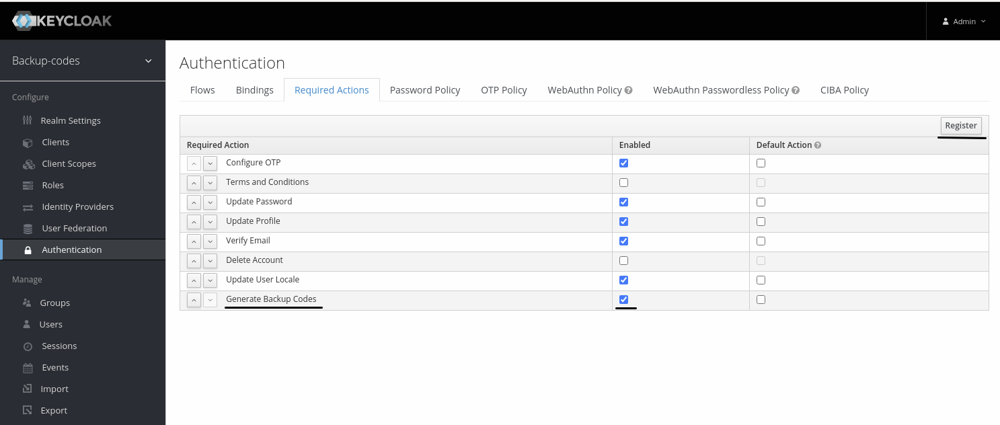
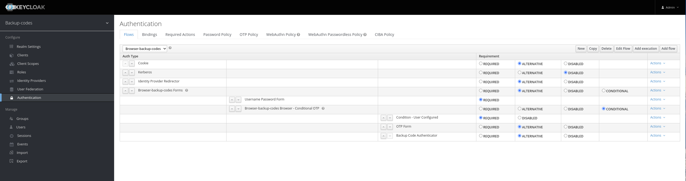
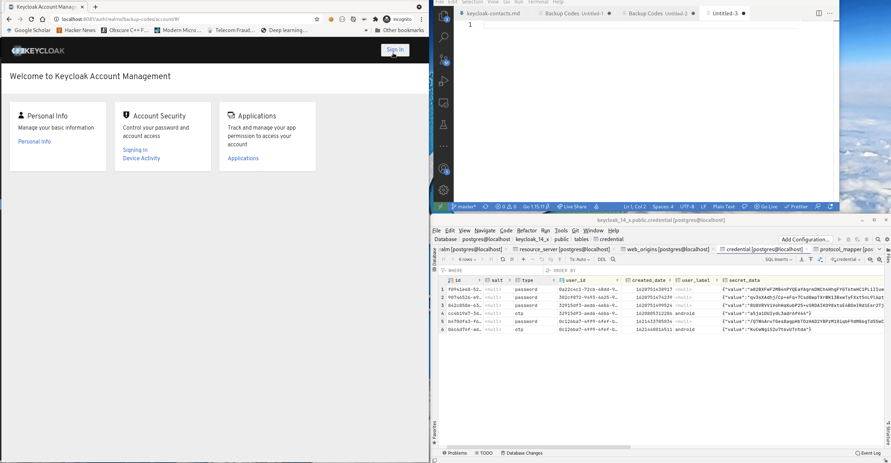

PoC for Backup Code Support in Keycloak
-----

This extension pack adds support for registering Backup Codes to recover a lost 2nd factor.

The example consists of the following main components:
- CredentialProvider - Adds support for storing and validating Backup Codes
- RequiredAction - User Initiated Action (UIA) that allows to generate Backup Codes
- Authenticator - Validates a given backup code as an alternative 2nd factor 

# Required Action

# Authentication Flow

# Demo
