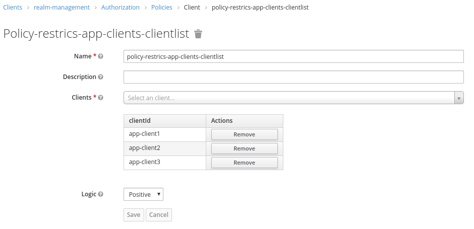
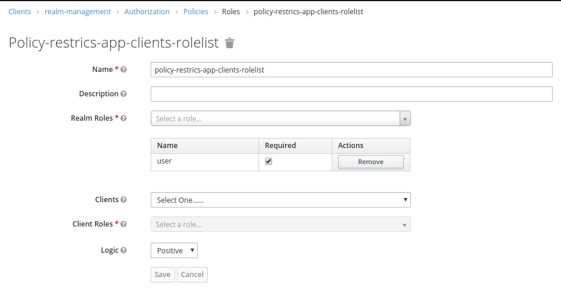
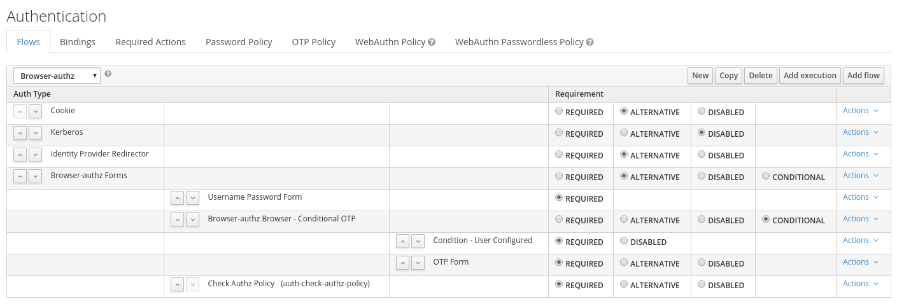

Authz Authenticator
----

Example for an Authorization Service aware authenticator which can evaluate 
authorization polices to determine whether a user is allowed to access 
a particular client.  

This authenticator can be configured with a client policy and a role policy.
The client policy is used to determine which clients access should be restructed by this authenticator.  
If the user wants to authenticate for such a restructed client, then the role policy is used to determine the  
required role a user needs to have to be able to access the client. If the user has the appropriate role, 
the access is granted, otherwise it is denied.   

# Configuration

## Policy Definitions

### Client Policy
This policy determines which for which clients access should be restricted.  

### Role Policy
This policy determines which roles are required to access a set of clients.  

## Authentication Flow
We create a copy of the browser flow to be able to add our Authz Authenticator.  

### Authz Policy Authenticator
In the Authz Policy Authenticator configuration we refer to role and client policy.  
