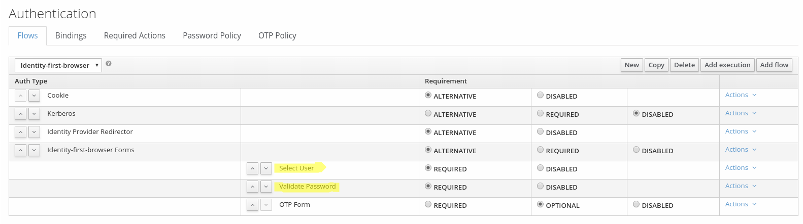

Identity First Authenticator for Keycloak
======

This is a simple version of a Google like multi step authentication flow where the traditional username 
password dialog is split into two separate steps.

An example authentication flow that uses the authenticators can look like this:
 

The following gif shows the authenticators in action:


# Extension specific resource theme

This example also demonstrates how to use custom JS/CSS and image resources with an authenticator
by using an extension specific theme.
See `auth-identity-first-extension/src/main/resources/theme/auth-identity-first-extension-theme` as well as 
`theme-resources/templates/select-user-form.ftl´. The extension specific theme resources can then be accessed via
relative resource links, e.g.: 
```html
<link rel="stylesheet" href="${url.resourcesPath}/../auth-identity-first-extension-theme/css/identity-first.css">

<script src="${url.resourcesPath}/../auth-identity-first-extension-theme/js/identity-first.js" defer></script>
```

# Build

To build this extension just run the following command:
```
mvn clean package

```

# Deploy
To deploy the example, just copy the resulting `auth-identity-first-extension-xxxx-SNAPSHOT.jar` jar  
from the `traget` folder to the `standalone/deployments` folder of your Keycloak installation.

