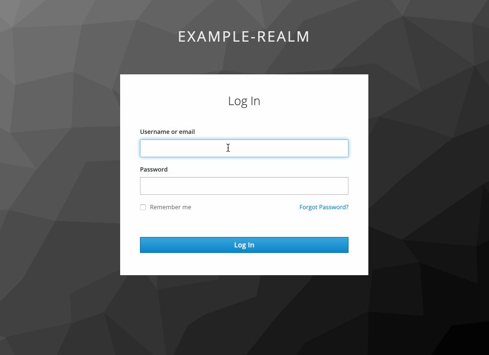

# Auth require group extension

This extension provides an authentication action that will require a user to be part of a specified group.

## Installation

Copy the JAR into `/opt/jboss/keycloak/standalone/deployments/`

## Configure

- Copy the `Browser` authentication 
- Add a new execution, select "Required Group"
- Click the newly added execution and specify the group that has access
- On your restricted clients, set this authentication

## Demo

User `in_group` is in the allowed group and can login, user `not_in_group` is not in the allowed group and gets a message stating no access.

