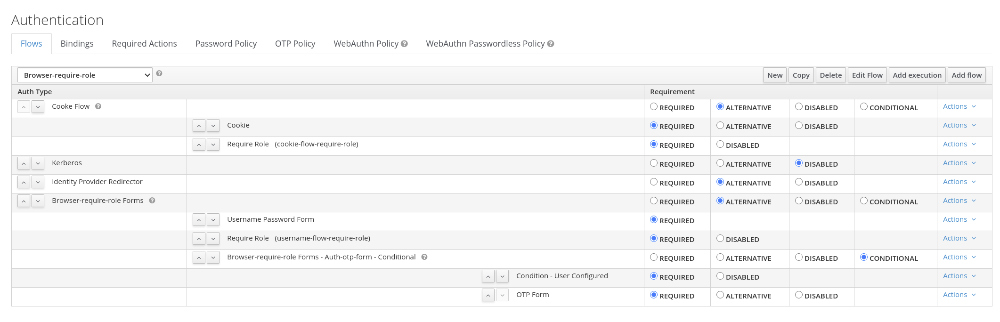
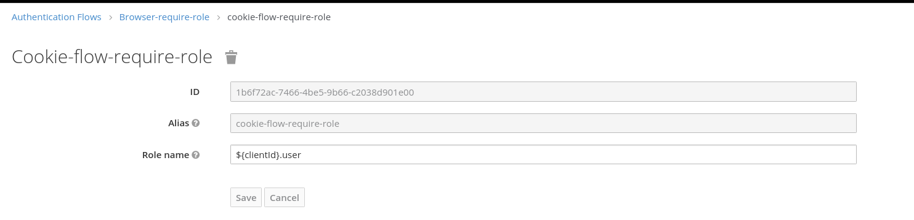
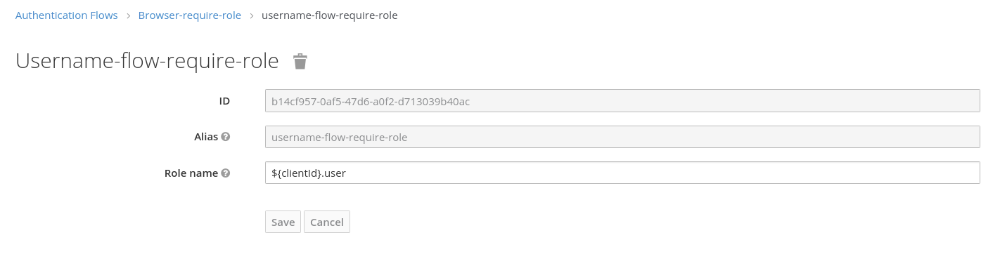
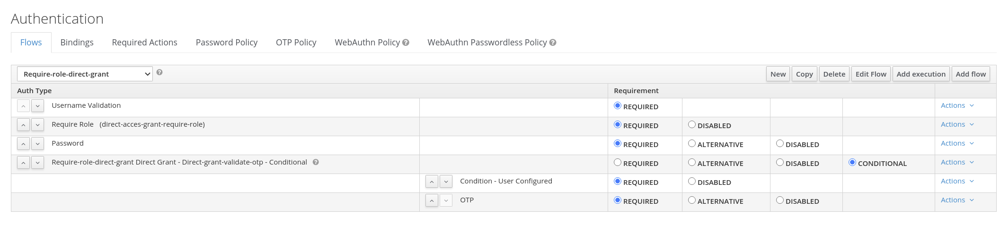
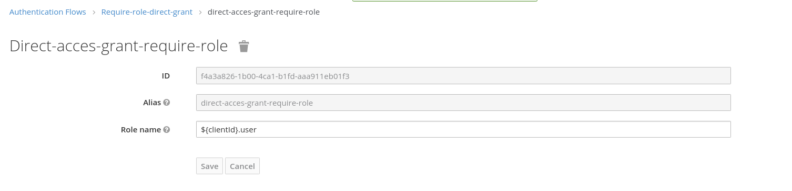
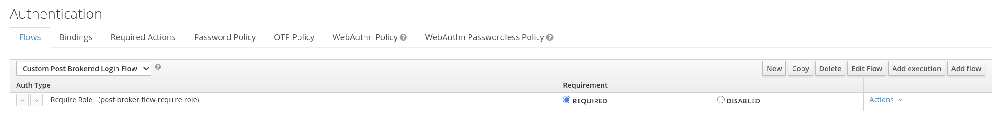
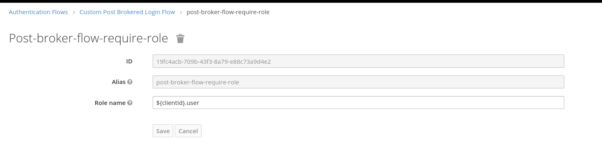
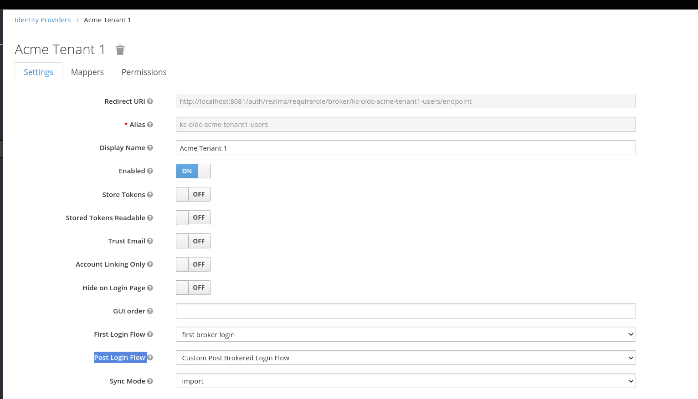

Require Role Authenticator
---

This example provides a custom `require-role` authenticator, that allows access to clients based on a client role.
The authenticator configuration supports a dynamic role expression to resolve the required role that a user needs
to have in order to access a client.

The role expression can be a fixed realm role, a fixed client role or a dynamic client role.
An expression without a dot is considered to be a realm role.

## Fixed realm role
The expression `user` would require that a user has the realm role `user` in order to access the application.

## Fixed client role
The expression `client1.user` would require that a user has the role `user` for `client1` in order to access the application.
If `client1` does not have the `user` role this check is ignored.

## Dynamic client role 
The expression `${clientId}.user` would require that a user has the role `user` for the given target client in order to access the application.
If the target client does not have the `user` role this check is ignored.

# Configuration Example

